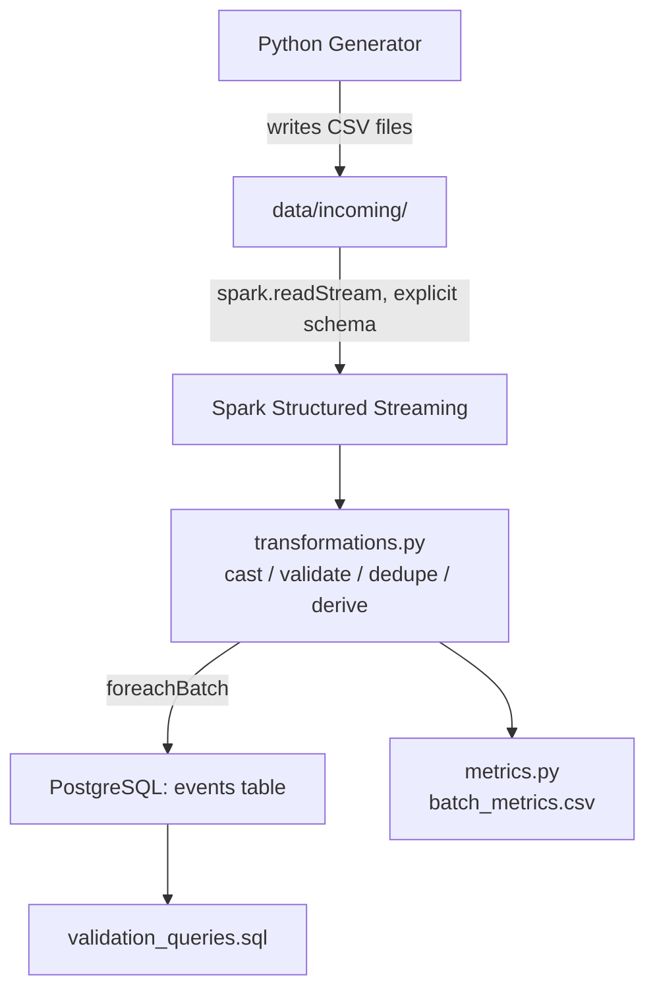

# Architecture

## Diagram

## Component Walkthrough

### 1. Python Generator (`src/generator/data_generator.py`)

Generates synthetic `view`/`purchase` events and writes each batch to a
uniquely-named CSV file in `data/incoming/`. A unique filename per batch
matters because Spark's file-source streaming detects new files by name —
appending to one file would not trigger reprocessing.

### 2. CSV Files (`data/incoming/`)

The interface between the generator and Spark. Deliberately the simplest
possible hand-off mechanism — no broker, no queue — appropriate for this
project's local, single-machine scope.

### 3. Spark Structured Streaming (`src/streaming/stream_reader.py`,
`spark_session.py`)

- `spark_session.py` builds a `SparkSession` with a low
  `spark.sql.shuffle.partitions` (appropriate for small local micro-batches).
- `stream_reader.py` defines `EVENT_SCHEMA` explicitly and calls
  `spark.readStream.format("csv").schema(EVENT_SCHEMA).load(...)`.
  Structured Streaming requires an explicit schema for file sources.

### 4. Data Transformation & Validation (`src/streaming/transformations.py`)

Pure DataFrame → DataFrame functions, run in this order:

1. `cast_and_clean_types` — string → int/double/timestamp, nulls on
   cast failure rather than crashing.
2. `filter_invalid_records` — drops rows with nulls in required fields,
   unrecognized `event_type`, negative price/quantity, or purchases with
   `quantity <= 0`.
3. `deduplicate_events` — drops duplicate `event_id`s *within* the current
   micro-batch (`dropDuplicates`).
4. `add_derived_fields` — computes `total_amount = quantity * price` for
   purchases (0 for views).
5. `add_ingestion_metadata` — stamps `ingested_at`.

Being pure functions with no streaming-specific API dependency is what
lets `tests/test_transformations.py` test them directly with a local batch
Spark session.

### 5. PostgreSQL (`sql/create_tables.sql`, `src/database/postgres.py`)

- Schema uses typed columns (`INTEGER`, `NUMERIC`, `TIMESTAMP`), not
  strings for everything.
- `event_id` is the `PRIMARY KEY`, which is the durable, cross-batch
  duplicate-prevention mechanism (Spark's own dedup is only within a
  micro-batch — see above).
- `write_batch_to_postgres` is passed to `writeStream.foreachBatch(...)`
  and uses Spark's JDBC batch writer (`DataFrame.write.jdbc`) rather than
  row-by-row inserts.

### 6. Validation & Metrics (`sql/validation_queries.sql`,
`src/monitoring/metrics.py`)

- SQL queries confirm data landed correctly and support basic analytics
  (revenue, top users, top products).
- `metrics.py` records real per-batch timing/throughput to
  `outputs/performance/batch_metrics.csv` and aggregates it into the
  summary described in `docs/performance_metrics.md`.
