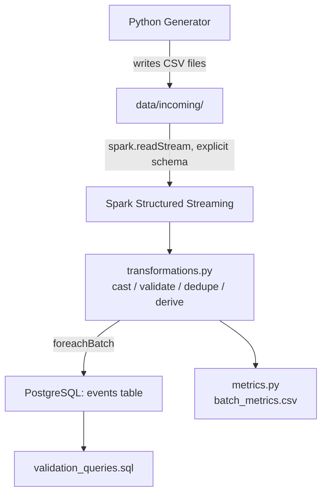

# Architecture

## Diagram

## Component Walkthrough

### 1. Python Generator (`src/generator/data_generator.py`)

Generates synthetic `view`/`purchase` events and writes each batch to
`data/incoming/events_<n>.csv`, numbering batches sequentially from 1. A
distinct filename per batch matters because Spark's file-source streaming
detects new files by name — appending to one file would not trigger
reprocessing.

Because Spark tracks consumed files by name, the numbering is derived from the
files already on disk rather than from an in-memory counter: a restarted
generator continues from the highest existing number instead of overwriting
`events_1.csv`, whose new contents Spark would never notice.

Each batch is written under a dot-prefixed temporary name and then renamed into
place. Spark polls the directory, so a file written directly to its final name
can be read while still partially flushed; Spark's file source ignores entries
beginning with `.` or `_`, so the batch stays invisible until the rename
publishes it atomically.

### 2. CSV Files (`data/incoming/`)

The interface between the generator and Spark. Deliberately the simplest
possible hand-off mechanism — no broker, no queue — appropriate for this
project's local, single-machine scope.

### 3. Spark Structured Streaming (`src/streaming/stream_reader.py`,
`spark_session.py`)

- `spark_session.py` builds a `SparkSession` with a low
  `spark.sql.shuffle.partitions` (appropriate for small local micro-batches).
- `stream_reader.py` defines `EVENT_SCHEMA` explicitly and calls
  `spark.readStream.format("csv").schema(EVENT_SCHEMA).load(...)`.
  Structured Streaming requires an explicit schema for file sources.

### 4. Data Transformation & Validation (`src/streaming/transformations.py`)

Pure DataFrame → DataFrame functions, run in this order:

1. `cast_and_clean_types` — string → int/decimal/timestamp, nulls on
   cast failure rather than crashing. Money uses `DecimalType`, matching the
   `NUMERIC` columns in `create_tables.sql`, so prices and totals stay exact
   instead of picking up binary floating-point error.
2. `filter_invalid_records` — drops rows with nulls in required fields,
   unrecognized `event_type`, negative price/quantity, or purchases with
   `quantity <= 0`.
3. `deduplicate_events` — drops duplicate `event_id`s *within* the current
   micro-batch (`dropDuplicates`).
4. `add_derived_fields` — computes `total_amount = quantity * price` for
   purchases (0 for views).
5. `add_ingestion_metadata` — stamps `ingested_at`.

Being pure functions with no streaming-specific API dependency is what
lets `tests/test_transformations.py` test them directly with a local batch
Spark session.

### 5. PostgreSQL (`sql/create_tables.sql`, `src/database/postgres.py`)

- Schema uses typed columns (`INTEGER`, `NUMERIC`, `TIMESTAMP`), not
  strings for everything.
- `event_id` is the `PRIMARY KEY`, which is the durable, cross-batch
  duplicate-prevention mechanism (Spark's own dedup is only within a
  micro-batch — see above).
- `write_batch_to_postgres` is passed to `writeStream.foreachBatch(...)`
  and uses Spark's JDBC batch writer (`DataFrame.write.format("jdbc")`)
  rather than row-by-row inserts.
- The batch is `persist()`ed, because the row count and the write are two
  separate Spark actions and would otherwise each recompute the whole batch.
- **The write is a two-step, idempotent merge.** Each micro-batch is bulk-loaded
  into `events_staging` (`overwrite` + `truncate=true`), then merged into
  `events` with `INSERT ... SELECT ... ON CONFLICT (event_id) DO NOTHING`.
  Spark's JDBC writer offers only append and overwrite, with no way to skip
  existing rows, so a plain append cannot survive a retry — see below.
- **A failed write is re-raised, not swallowed.** Returning normally from
  `foreachBatch` tells Spark the batch succeeded, so Spark would commit the
  offsets and never re-read those files, turning a transient database error
  into silent data loss. Raising leaves the batch uncommitted for the next
  restart to replay.
- Those two points depend on each other. A batch that fails partway has
  already committed some of its partitions, so the replay re-presents rows
  that are present. With a plain append that replay raises a primary-key
  violation, fails again, and crash-loops forever. The merge makes the replay
  a no-op for rows already stored, so retrying always converges. Observed in
  practice: a replayed batch logs
  `Batch 32 written (0 of 150 records inserted, 150 already present)` and the
  query carries on.
- Metrics recording is wrapped in its own `try`/`except`. It runs *after* the
  rows are committed, so letting it fail would kill the query over an
  unwritable CSV and strand a batch whose data was already durable.

### 6. Validation & Metrics (`sql/validation_queries.sql`,
`src/monitoring/metrics.py`)

- SQL queries confirm data landed correctly and support basic analytics
  (revenue, top users, top products).
- `metrics.py` records real per-batch timing/throughput to
  `outputs/performance/batch_metrics.csv` and aggregates it into the
  summary described in `docs/performance_metrics.md`.
